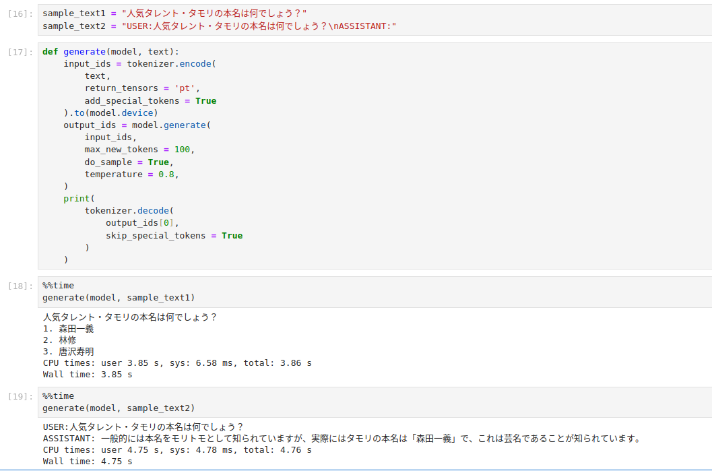

## memo

導入時、インストール（RunPodではreq.txtが使えなかった・・・）

```
pip install datasets transformers[torch] bitsandbytes
```

### 気付き

Chat Templateに沿って質問した場合としなかった場合の違い。

「文章生成」AIは「続きの文章を作ろうとすること」が分かる。

対話に特化させるためにChat Templateに従わせるのがよい。


